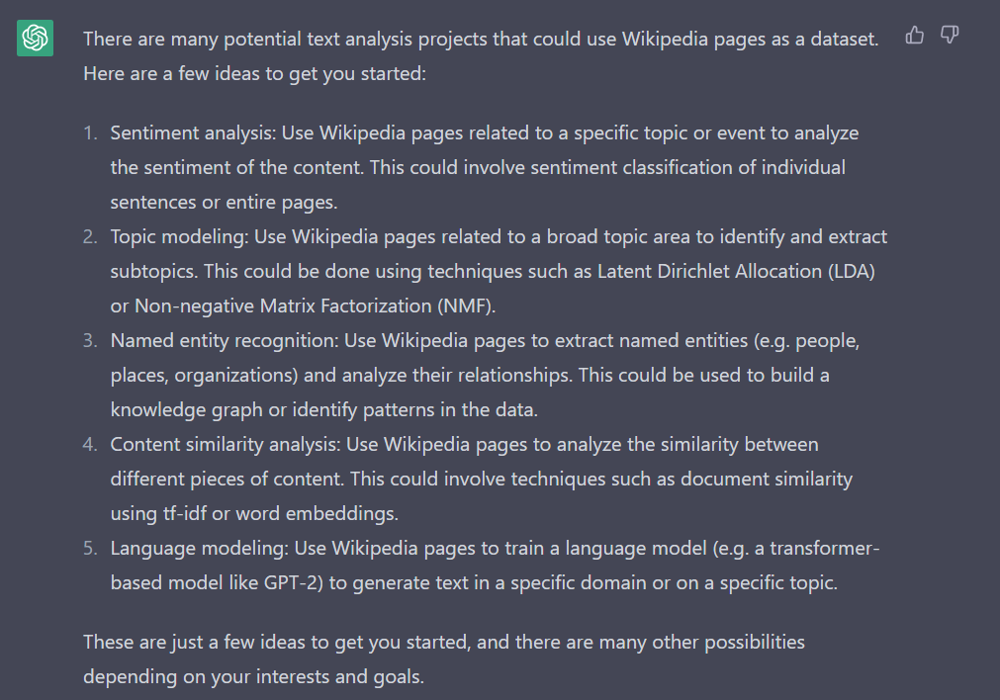
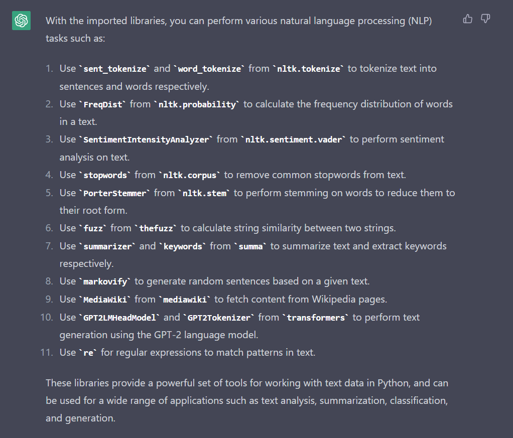
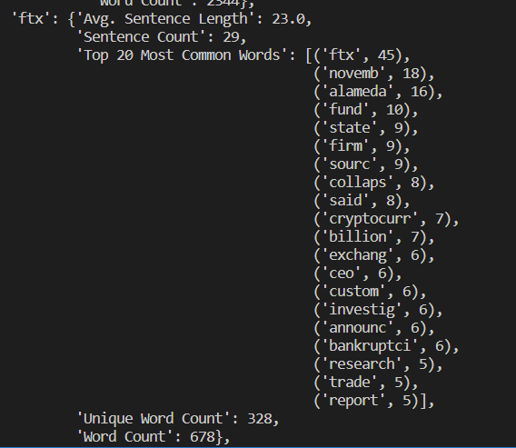
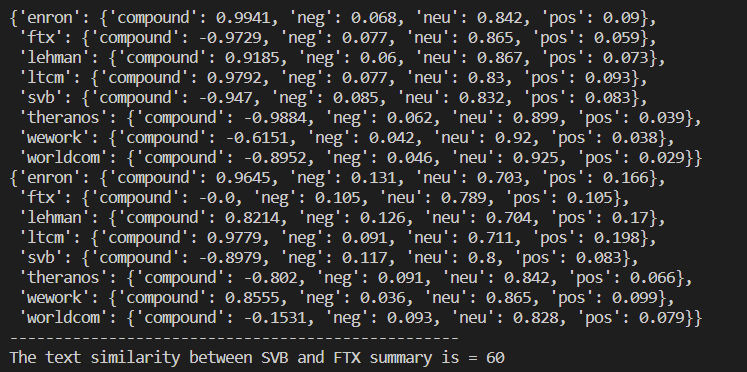
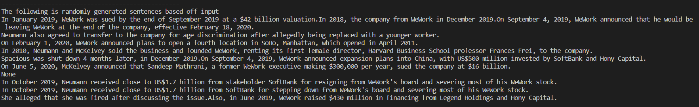
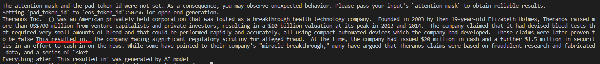

# Text-Analysis-Project
 
Please read the [instructions](instructions.md).

1. Project Overview (~1 paragraph)

What data source(s) did you use? What technique(s) did you use to process or analyze them? What did you hope to create or learn through this project?

### Project Overview - Data Sources, techniques, and learning goal. 
For this assignment I used Wikipedia data from infamous business failures, frauds, or collapses using the MediaWiki API. These are denotes in def main() under a topics dictionary that pairs the case key (ex. 'svb) to a more specific wikipedia topic such as "Collapse of Silicon Valley Bank".

I wanted to learn how to use API's and other natural language processing libraries to manipulate text. 

I started with a summarize_wiki function --> returns following dictionary 
results = {'Wiki Summary': summary_wiki,
               "Summa Summary": summa_summary,
               "Summa Keywords as List": summa_keywords_list,
               "Summa Keywords": summa_keywords,
               "Links": links}
And from there I experimented with different techniques to process and analyze - these included stop-word removal and word stemming, summary statistics and words frequencies, sentiment analysis, text-similarity, markov analysis, and lastly using GPT-2 model to generate text based on the input summary from previous functions. 

My goal was to learn how to use these tools - and learn how to search for the tools needed (find new libraries and take advantage of open source) - as opposed to preforming one specific analysis. 

2. Implementation (~1-2 paragraphs + screenshots)

Describe your implementation at a system architecture level. You should NOT walk through your code line by line, or explain every function (we can get that from your docstrings). Instead, talk about the major components, algorithms, data structures and how they fit together. You should also discuss at least one design decision where you had to choose between multiple alternatives, and explain why you made the choice. Use screenshots to describe how you used ChatGPT to help you or learn new things.

### Implementation

I approached this project top-down approach starting with the functions to pull information from Wikipedia and then subseqent functions to analyze the text. I had to decide if to run the functions for each topic separate or use a dictionary to store all the information and then build separate functions to traverse and analyze. I also asked Chat GPT for suggestions regarding libraries I could use to summarize, find keywords, do frequency distributions, sentiment analysis, remove stop words, stem word list, find text similarity, generate markov analysis sentences, and GPTw Modeling.  

I also used Chapt GPT in initial brainstorming by asking it for text analysis ideas. 

I then used it to evaluate the libraries I was using to ensure they were adequate.  

All of these were integrated with a nested dictionary data structure to simplify the subsequent functions. Then I created a function that would loop through the dictionary and run another function for the specified result given a key. I did my best to break up the code functionality into various functions. This was very useful practice in approaching problems and working on breaking them down into smaller components.This allowed for the end results that is easily editable.  

3. Results (~2-3 paragraphs + figures/examples)

### Results

Present what you accomplished in your project:

If you did some text analysis, what interesting things did you find? Graphs or other visualizations may be very useful here for showing your results.
If you created a program that does something interesting (e.g. a Markov text synthesizer), be sure to provide a few interesting examples of the program's output.

My def main() code (main() function) runs through all the functionality of the code with sample inputs. HOWEVER, there are many more possible inputs.  

There are many more possible way to analyze the dictionary - however I chose to create generalized functions that would work with a standardized input and provided text summary of examples. 

1. ### Will generate summary statistics after running summarize_all on topics dictionary which stores all the data in one dictionary{}.
    

2. ### Generates sentiment analysis for every topic summary and keyword and stores it in a dictionary + Includes text similarity function and example of SVB vs FTX
    

3. ### Markov Text synthesizer generates 10 sentences based on specified topic and sample text -- in this example WeWork Summa Summary
    

4. ### GPT2 language model uses a trimming function to cut input text into useable size (summa summary too long) and attach prompt str ("This results in, ) and using pretrained model to generate text. 
    
   

4. Reflection (~1-2 paragraphs)

### Reflection

From a process point of view, what went well? What could you improve? Was your project appropriately scoped? Did you have a good testing plan?

From a learning perspective, mention what you learned through this project, how ChatGPT helped you, and how you'll use what you learned going forward. What do you wish you knew beforehand that would have helped you succeed?

I learned a lot about API and the power of open source libraries -- and how they allow me to generate surprisingly powerful outputs without creating the tools from scratch. I also learned how to plan the algorithms and break up the functionality of my functions. I could further improve by adding subsequent analysis that further adds onto the existing code. I would like to use Open AI APi to input summarized texts, keywords, and more and have it preform natural Language Processing and Analysis on it. I think the scope of this project was ambitious and properly scoped. I also spent a LONG time testing - ensuring models worked and troubleshooting errors. 

Chapt GPT was useful in this regard - often pointing out mistakes or prompting me to download the correct or updated libraries when I could not figure out specific error prompt. Additionally, before this I wish I had known about more libraries in depth so I could do further analysis and applications without having to search for a library for that specific function. 